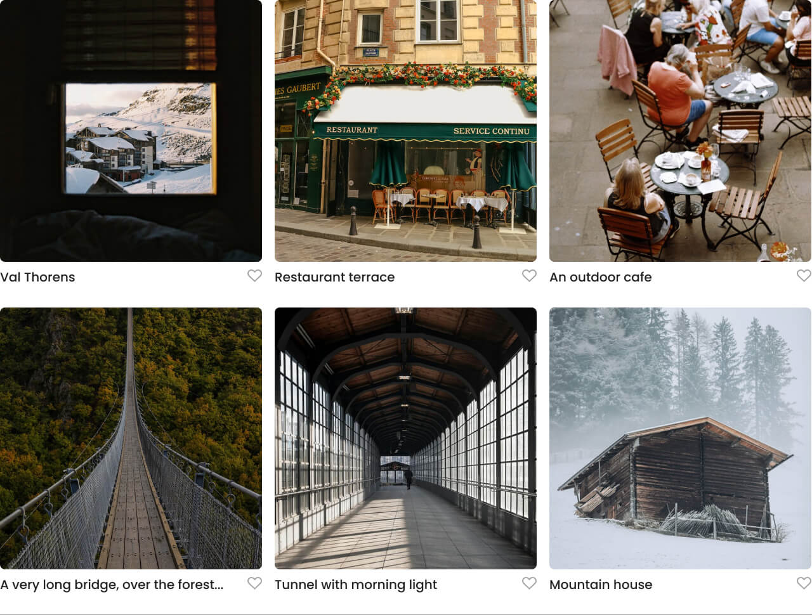
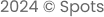

# Project 3: Spots

## Description

This is a profile page for social media site called Spots. It has two seperate layouts: One designed for mobile devices and the other designed for desktops. But it's responsive and flexible design is useable on many devices such as tablets too.

### Profile Header

The profile header consists of a profile picture, name, and description on the left along with an "Edit Profile" button to update these. The Edit Profile uses a standard hover effect. On the right there is a "New Post" button which allows you to post new content in the card section. This also utilizes a standard hover effect.

The header shrinks into one column when the screen hits a max-width of 627px or below. This allows for compatibility with smaller screens.

### Content Cards

The content cards display the images you post with a description and the option to like them as well. The like icon is shaped like a heart and uses a hover effect. The cards are layed out using a grid declarations which allows the number of columns to shrink as the size of the screen does. This columns are stacked on eachother to form one single column. This is to help compatibility with different size screens.

### Footer

The footer simply displays the date, copyrights symbol, and "Spots". It remains centered and consistant from all screen views.

- [Deployment Link](https://a-kovacev.github.io/se_project_spots/)

### Overview

- Intro
- Figma
- Images

**Intro**

This project is made so all the elements are displayed correctly on popular screen sizes. We recommend investing more time in completing this project, since it's more difficult than previous ones.

**Figma**

- [Link to the project on Figma](https://www.figma.com/file/BBNm2bC3lj8QQMHlnqRsga/Sprint-3-Project-%E2%80%94-Spots?type=design&node-id=2%3A60&mode=design&t=afgNFybdorZO6cQo-1)

**Images**

The way you'll do this at work is by exporting images directly from Figma — we recommend doing that to practice more. Don't forget to optimize them [here](https://tinypng.com/), so your project loads faster.
